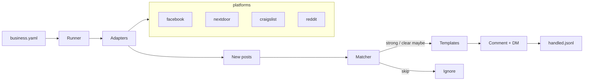

# Social Lead Watcher

Config-driven watcher that scans social sources for **new homeowner / job-request posts**, scores them (**strong / maybe / skip**), and outreach as the business identity (public comment + DM) with a JSONL dedupe log.

Designed as a **standalone, reusable** package for *any* local business — Facebook groups first, other platforms via the same adapter interface.

## What it does

- Scores posts from keywords, geo, and skip patterns in `config/business.yaml`
- Acts on **strong** + **clear maybe** only
- Dedupes via `data/handled.jsonl` so posts are never double-commented
- Caps outreach volume per run; newest posts first
- Never invents feed content; reports outreach with real links
- Two modes: **agent/browser playbooks** (default) or future **automation** adapters

## Architecture



## Quickstart

```bash
python -m venv .venv && source .venv/bin/activate
pip install -r requirements.txt

# Score a sample (uses the generic home-services example — placeholders only)
python -m lead_watcher score \
  --config config/examples/home-services.yaml \
  --text "Looking for vinyl siding contractor in Seattle"

python -m lead_watcher render-comment \
  --config config/examples/home-services.yaml \
  --need "vinyl siding"

# Create your local config (gitignored)
python -m lead_watcher init-config --out config/business.yaml
```

Copy `config/business.example.yaml` for a fully commented template. Do **not** put real Facebook cookies or another business's phone/license in the repo.

## CLI

| Command | Purpose |
|---|---|
| `python -m lead_watcher score --config … --text "…"` | Classify a post |
| `python -m lead_watcher render-comment --config … --need "…"` | Render public comment |
| `python -m lead_watcher render-dm --config … --need "…"` | Render DM |
| `python -m lead_watcher init-config --out config/business.yaml` | Starter YAML |
| `python -m lead_watcher playbook --config …` | Print agent playbooks |
| `python -m lead_watcher run --config … --dry-run` | One cycle (agent mode if fetch unimplemented) |

## How to add a platform

1. Subclass `lead_watcher.platforms.base.PlatformAdapter`
2. Implement `list_watched_sources`, `fetch_new_posts`, `post_comment`, `send_dm`
3. Raise `ManualBrowserRequired` (with a playbook) until automation exists
4. Register in `get_adapter()`
5. Document the roadmap in `docs/PLATFORMS.md`

## Agent pack

Cursor / Grok-style agents: see `agent/SKILL.md`, `agent/ROUTINE.md`, `agent/SETUP.md`, `agent/getting-started.md`.

## Tests

```bash
pip install -e ".[dev]"
pytest
```

## License

MIT — see `LICENSE`.
